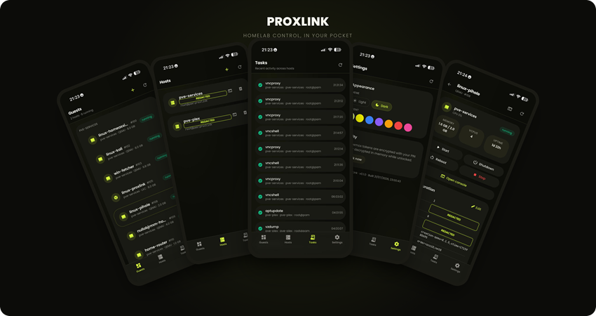

# ProxLink



A mobile PWA for managing Proxmox VE hosts from your phone. Self hosted,
built to run as an LXC on Proxmox itself.

Built with Next.js and Tailwind. See [`SECURITY.md`](./SECURITY.md).

## Features

App lock (PIN, AES 256 GCM), multi host dashboard, guest lifecycle control,
config editing, create wizard, ISO and template download from a URL,
snapshots and backups, VNC and terminal console (keyboard, Tab and arrows,
auto resize), node shell, cross host tasks, theming, installable as a PWA,
allowlisted proxy, SSRF guard, CSP headers, audit log.

## Setup

### 1. Proxmox API token

A new token has **no permissions** by default (Privilege Separation).
Disable it to inherit the user's rights, or grant a role.

Web UI: Datacenter → Permissions → API Tokens → Add, uncheck Privilege
Separation, copy the secret. Or via shell:

```bash
pveum user token add root@pam proxlink --privsep 0
```

Use least privilege: a dedicated role, not `root@pam`. Console needs
`VM.Console`, node shell needs `Sys.Console`, listing needs
`VM.Audit`, `Sys.Audit` and `Pool.Audit`, lifecycle needs `VM.PowerMgmt`,
and snapshots and backups need `VM.Snapshot` and `VM.Backup`. A silent
feature failure almost always traces back to a missing privilege here.

### 2. Deploy

The LXC installer is the quickest path. Run it on a Proxmox host:

```bash
bash -c "$(curl -fsSL https://raw.githubusercontent.com/BeardedTech0o/prox-link/main/scripts/install-lxc.sh)"
```

Tunable through env vars: `CTID`, `CT_HOSTNAME`, `DISK_GB`, `RAM_MB`,
`CORES`, `BRIDGE`, `STORAGE`.

Or deploy manually on any Docker host:

```bash
git clone https://github.com/beardedtech0o/prox-link.git && cd prox-link
docker compose up -d --build
```

Browse to `http://<ip>:3000`. The SQLite database lives in the
`proxlink-data` volume, so back it up if it matters to you.

### 3. First run

Add ProxLink to your home screen. Set a PIN (there is no recovery if you
forget it). Under Hosts, tap Add and enter the base URL with port, the
token ID and the token secret. Leave Verify TLS off for a self signed
certificate; ProxLink pins the fingerprint instead. Test the connection,
then save.

## Creating a VM and downloading an ISO

Tap the plus button on the dashboard to open the create wizard: choose the
host, node, VM or LXC type, cores, RAM, disk and network bridge. Need an
image first? The Download ISO/template from URL section pulls one
straight into Proxmox storage with live progress, ready to select for the
new guest.

## Configuration

`PORT` (3000), `HOST` (0.0.0.0), `PROXLINK_DATA_DIR` (`/data`),
`PROXLINK_ALLOW_PRIVATE_ISO` (0). Run it behind HTTPS on a trusted or VPN
network in production.

## Updating

```bash
cd /opt/proxlink && git pull && docker compose up -d --build
```

## Watchdog

The installer adds a systemd timer that restarts Docker or the container
when it gets stuck, including when the network breaks without any visible
error. To add it to an existing install:

```bash
pct exec <CTID> -- bash -c "cd /opt/proxlink && git pull"
pct exec <CTID> -- bash /opt/proxlink/scripts/watchdog/install.sh
```

For optional webhook alerts, set `PROXLINK_WATCHDOG_WEBHOOK=<url>` in
`/etc/default/proxlink-watchdog`, then restart the timer.

## Troubleshooting

If you see "Request timed out" while Proxmox's own UI works fine, the
network path from ProxLink is broken, not Proxmox. Try
`systemctl restart docker` after a host OS upgrade. IPs are more reliable
than hostnames.

## Development

```bash
npm install && npm run dev
npm run typecheck && npm run lint && npm test && npm run build
```

## Roadmap

Done: app lock, dashboard, lifecycle, config editing, create wizard,
ISO/template download, snapshots, backups, console, node shell, tasks.

Planned: monitoring charts, push notifications, cluster, storage, network,
firewall and user administration, passcode reset.

[](https://www.buymeacoffee.com/nullobj)
